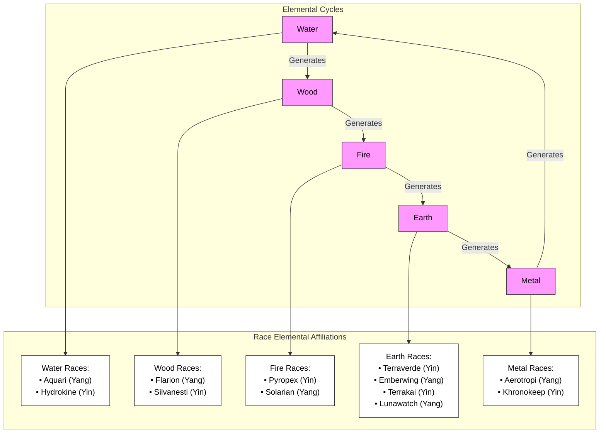

Here's a comprehensive table combining Chinese calendar years with traditional zodiac signs, creating unique fantasy races for your game:

| Race Name | Base Animal | Element | Yin/Yang | Key Characteristics |
| --- | --- | --- | --- | --- |
| Aquari | Rat | Water | Yang | Quick-witted engineers living in vast underwater cities |
| Terraverde | Ox | Earth | Yin | Patient geomancers who cultivate living crystal gardens |
| Flarion | Tiger | Wood | Yang | Forest-dwelling warriors with photosynthetic skin |
| Silvanesti | Rabbit | Wood | Yin | Graceful architects of organic tree-cities |
| Emberwing | Dragon | Earth | Yang | Magma-wielding artisans who craft living architecture |
| Pyropex | Snake | Fire | Yin | Enigmatic alchemists mastering thermal magic |
| Solarian | Horse | Fire | Yang | Nomadic sun-worshipers with solar-powered technology |
| Terrakai | Goat | Earth | Yin | Mountain-dwelling geomancers controlling earth and stone |
| Aerotropi | Monkey | Metal | Yang | Sky-dwelling inventors mastering aeromancy |
| Khronokeep | Rooster | Metal | Yin | Time-manipulating scholars preserving ancient knowledge |
| Lunawatch | Dog | Earth | Yang | Moon-aligned guardians with enhanced night vision |
| Hydrokine | Pig | Water | Yin | Aquatic healers mastering fluid manipulation |

